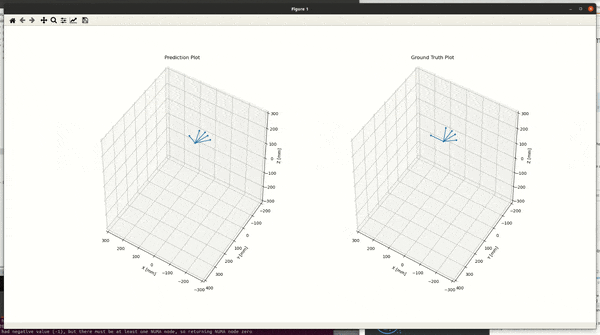
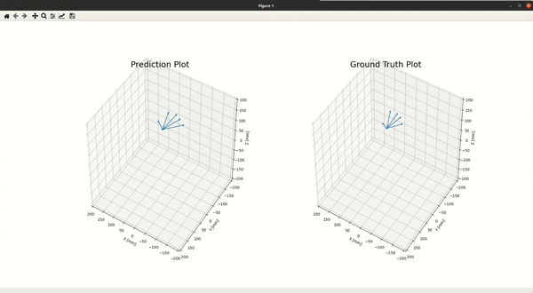
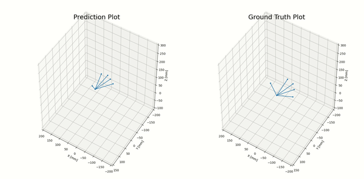

## 8th of April 12:00
Made an initial model to predict the position of the thumb.   
  
mean_absolute_error: 9.3363 - [1-ThumbAnalysis.ipynb](../Notebooks/1-ThumbAnalysis.ipynb)  
  

  
The above model uses a 4 layer dense neural network to predict the position of the thumb away from the Leap motion. 
This model was the first one I made and helped me build some infrastructure and workflow to build a serious model. 
I did not want to spend days making a low error model without being able to see if the basics I have work. Now I have the basic setup done, I know it works and can iterate on making it better.   
  
As this model predicts the absolute position of the thumb in space but not the relative position of the top of the thumb to another point on my arm, such as my palm. The model will always be wrong if my predictions are made with my hand further away from the leap motion than the data in the test set.  
  
### 8th of April 18:00  
mean_absolute_error: 6.9751 - [2-RelThumbAnalysis.ipynb](../Notebooks/2-RelThumbAnalysis.ipynb)  
    

  
Above is a model, trained to predict the thumb position relative to the model of the palm. 
The input and output variables of this model were also MinMax scaled, which reduced the mean_absolute_error from over 38 to under 0.18, this helped the network a lot. The same 4 layer architecture was used in this model as above.     

### 9th of April 15:50  
mean_absolute_error: 9.4036 - [3-SixtySecondsOfThumbData.ipynb](../Notebooks/3-SixtySecondsOfThumbData.ipynb)  
  

  
Moving from 30 seconds of training data to 60 seconds gives better results.  
The model knows when I stretch my thumb but fails to understand the direction I am pointing my thumb.  

### 9th of April 22:12
  
mean_absolute_error: 8.1070 - [4-FourMinutesOfThumbDataSeq+RNN.ipynb](../Notebooks/4-FourMinutesOfThumbDataSeq+RNN.ipynb) 
  
I collected 4 minutes of data using an RNN, the best validation mae I got was 0.1273 using an RNN.  
For comparison 0.1339 was the best mae achieved using a normal fully connected network. 
The validation data chosen was the first 500 ~ 10 seconds of data, so to not validate using data that was gathered while I was fatigued.   

